<!--
  SETUP NOTES — invisible on the rendered page, only visible here in the source.
  Delete this comment once everything below is live.

  1. This file has to live in a repo named exactly `aaziy` (your username). If it doesn't
     exist yet: create a new PUBLIC repo called `aaziy/aaziy` and tick "Add a README file".
  2. Commit this README.md alongside the /assets and /.github/workflows folders, keeping the
     same relative paths, so the hero banner and the snake workflow both resolve.
  3. Open the repo's Actions tab and run "snake-contribution-graph" once manually (Run workflow
     button) — it needs that first run to create the `output` branch before the SYS.COMMITS
     image shows up. After that it refreshes itself every day on its own.
  4. Swap the four `<!-- confirm repo slug -->` links under SYS.PROJECTS for your real repo
     URLs, and drop in live-demo links if you have them.
  5. SYS.ACTIVITY widgets can take a few hours to catch up on a brand-new repo — that's normal.
-->

<div align="center">



<a href="https://readme-typing-svg.demolab.com">
  
</a>

<br/>


</div>

<br/>

### `[ SYS.ABOUT ]`

```text
$ whoami --verbose

> USER.............. Muhammad Aziq Rauf
> ROLE.............. AI/ML Engineer — LLMs · Computer Vision · MLOps
> BASE.............. Islamabad, PK
> EDU............... B.S. Software Engineering @ FAST-NUCES (2026)
> AWARDS............ Top 5% nationally, HEC NSCT  ·  IBM AI Engineering + LLM Dev certified
> RIG............... Apple M1 Max  ·  32-core GPU  ·  64GB unified memory  ·  used for local LoRA runs
> CURRENTLY......... fine-tuning LLaMA 3.1, shipping RAG pipelines, occasionally reading about NPV for fun
> NEXT_MOVE......... relocating to the Gulf (Bahrain) for an AI/ML engineering role
> OFF_DUTY.......... gym six days a week, chess, rooftop BBQs, chasing mountain passes around Hunza & Naltar
> UPTIME............ 22 years, mostly stable, occasional kernel panics
```

<br/>

### `[ SYS.STACK ]`

<div align="center">

**languages**
<br/>


<br/><br/>

**ml / cv**
<br/>

<br/>


<br/><br/>

**infra / tools**
<br/>

<br/>


</div>

<br/>

### `[ SYS.EXPERIENCE ]`

```text
$ cat experience.log

[2025.06 → 2025.08]  AI Developer Intern @ Cloudtek, Islamabad
  > integrated TensorFlow models into production-facing web interfaces
  > partnered cross-functionally to clean & preprocess datasets for ML pipelines
```

<br/>

### `[ SYS.PROJECTS ]`

<table>
<tr>
<td width="50%" valign="top">

#### `[ PRJ.QACE ]`
**Multimodal AI Interview Coach**

Watches, listens, and reads your interview back to you — facial-expression recognition, Whisper transcription, and a LoRA fine-tuned LLaMA 3.1 running in parallel. Async inference keeps all three models live without the UI ever stuttering.

    

[`→ live`](https://qandace.vercel.app)  [`→ code`](https://github.com/aaziy/qace-interview-coach)

</td>
<td width="50%" valign="top">

#### `[ PRJ.SENTINEL_SUPPORT ]`
**AI Customer Support Platform**

A user help center and an admin command center sharing one brain: a LangChain + Pinecone RAG pipeline that drafts contextual replies on its own, and knows exactly when to escalate to a human.

    

[`→ live`](https://sentinel-support.vercel.app)  [`→ code`](https://github.com/aaziy/sentinel-support)

</td>
</tr>
<tr>
<td width="50%" valign="top">

#### `[ PRJ.AEGISVISION ]`
**Real-Time Traffic Monitoring**

Benchmarked YOLO26n against RT-DETRv2 and shipped the winner: 47 FPS at 1080p on Apple Silicon via the CoreML execution provider, exported to a single ONNX model that runs unmodified on Mac or Linux/ARM64. ByteTrack handles vehicle tracking; a bidirectional line-crossing counter keeps per-class tallies checked against hand-labeled ground truth.

    

[`→ live`](https://huggingface.co/spaces/aaziy/AegisVision)  [`→ code`](https://github.com/aaziy/aegisvision)

</td>
<td width="50%" valign="top">

#### `[ PRJ.PHOENIXML ]`
**Automated MLOps for Fraud Detection**

A fraud-detection model (0.84 PR-AUC on a heavily imbalanced dataset) wrapped in a retraining pipeline that watches its own drift with Evidently, auto-promotes to MLflow Staging, and waits for a human nod before touching Production. Shipped as a Dockerized FastAPI service on GHCR, backed by 36 passing tests.

    

[`→ code`](https://github.com/aaziy/phoenixml) <!-- confirm this matches your actual repo slug -->

</td>
</tr>
</table>

<br/>

### `[ SYS.PUBLICATIONS_AND_LEADERSHIP ]`

```text
$ cat achievements.log

[2024]      Active member, Software Engineering Society (NASCON '24)

[2025]      Co-authored a computational study on plant physiological parameters
            → published in the SciNex Journal of Advanced Sciences

[2026.02]   Led a 4-person team at the NUST Hackathon
```

<br/>

### `[ SYS.ACTIVITY ]`

<div align="center">


<br/>


<br/>


</div>

<br/>

### `[ SYS.COMMITS ]`

<div align="center">


</div>

<br/>

### `[ SYS.CONTACT ]`

<div align="center">

<a href="https://www.linkedin.com/in/muhammad-aziq-rauf-b24730260/" target="_blank">
  
</a>
<a href="mailto:muhammadaaziq179@gmail.com" target="_blank">
  
</a>

<br/><br/>


</div>
